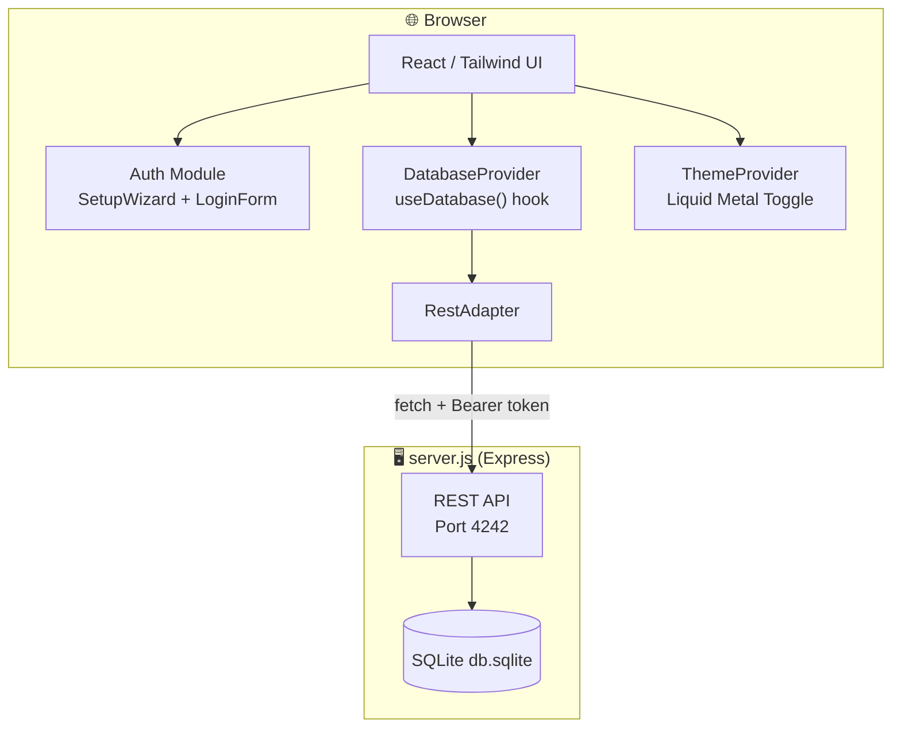

# 🦞 ClawChives

<div align="center">

```
  ██████╗██╗      █████╗ ██╗    ██╗ ██████╗██╗  ██╗██╗██╗   ██╗███████╗███████╗
 ██╔════╝██║     ██╔══██╗██║    ██║██╔════╝██║  ██║██║██║   ██║██╔════╝██╔════╝
 ██║     ██║     ███████║██║ █╗ ██║██║     ███████║██║██║   ██║█████╗  ███████╗
 ██║     ██║     ██╔══██║██║███╗██║██║     ██╔══██║██║╚██╗ ██╔╝██╔══╝  ╚════██║
 ╚██████╗███████╗██║  ██║╚███╔███╔╝╚██████╗██║  ██║██║ ╚████╔╝ ███████╗███████║
  ╚═════╝╚══════╝╚═╝  ╚═╝ ╚══╝╚══╝  ╚═════╝╚═╝  ╚═╝╚═╝  ╚═══╝  ╚══════╝╚══════╝
```

*Your Sovereign Pinchmark Library — where Humans and AI Lobsters collaborate to scuttle the web.*

</div>

---

[](https://vitejs.dev/)
[](https://reactjs.org/)
[](https://www.typescriptlang.org/)
[](https://tailwindcss.com/)
[](https://www.docker.com/)
[](https://www.sqlite.org/)
[](LICENSE)
[](#)

---

## 📜 Table of Contents

<details>
<summary>Unfurl the Scroll 📜</summary>

- [About](#-about)
- [Architecture](#-architecture)
- [Getting Started](#-getting-started)
  - [Prerequisites](#prerequisites)
  - [Running with npm](#-running-with-npm)
  - [Running with Docker](#-running-with-docker)
- [Key System](#-key-system)
- [API Reference](#-api-reference)
- [Project Structure](#-project-structure)
- [Available Scripts](#-available-scripts)
- [Contributing](#-contributing)
- [Security](#-security)

</details>

---

## 📌 About

**ClawChives** is a privacy-first, self-hostable **pinchmark** (bookmark) manager designed for the Human-Agent ecosystem. It stores your pinchmarks in an integrated SQLite backend, with a sovereign identity system that uses cryptographic key files instead of usernames and passwords.

No cloud. No landlords. Your reef, your rules.

- 🔐 **ShellCryption Auth** — login with a generated JSON identity file, not a password. Your key, your identity.
- 🤖 **Lobster Key System** — issue granular `ag-` API keys to your AI agents and scripts. Let your Lobsters scuttle the net.
- 🗄️ **SQLite Bedrock** — a fast, reliable, zero-dependency backend for persistent local storage.
- 🐳 **Docker-First** — fully containerized with named volume mounts for seamless self-hosting.
- 🌊 **Liquid Metal Theming** — a stunning circular-reveal View Transition on every theme switch.

---

## 🏗️ Architecture



---

## 🚀 Getting Started

### Prerequisites

- **Node.js** v20+
- **npm** v10+
- **Docker & Docker Compose** *(for containerized deployment)*

---

### 🐚 Running with npm

<details>
<summary>Expand npm instructions</summary>

**Install dependencies first:**
```bash
npm install
```

**Start everything (API + Frontend) concurrently:**
```bash
npm run start
```
> Fires up `server.js` on `http://localhost:4242` and Vite on `http://localhost:5173` together.

**Run just the API:**
```bash
npm run start:api
```
> Starts only `server.js`. Useful for running alongside a manually launched `npm run dev`.

**Run just the frontend (dev mode with HMR):**
```bash
npm run dev
```
> Requires the API to be running separately.

**Stop the API server:**
```bash
npm run stop:api
```

**Build the production bundle:**
```bash
npm run build
```
> TypeScript check + Vite production bundle → `dist/`

**Preview the production build locally:**
```bash
npm run preview
```

</details>

---

### 🐳 Running with Docker

<details>
<summary>Expand Docker instructions</summary>

**Environment Variables:**

```bash
# Default ports (edit in compose files if needed)
UI_PORT=5173
API_PORT=4242
CORS_ORIGIN=http://localhost:5173
```

**Option A: Production (Pull from GHCR) ⚓**
Use this for a stable, sovereign deployment. It pulls the latest pre-built images from the GitHub Container Registry.
```bash
docker compose up -d
```

**Option B: Development & Testing (Build Locally) 🛠️**
Use this if you are modifying the source code and want to test changes immediately.
```bash
docker compose -f docker-compose.dev.yml up -d --build
```

**Monitoring & Maintenance:**

- **View Logs**: `docker compose logs -f`
- **Stop Stack**: `docker compose down`
- **Volume Inspection**: `docker volume inspect clawchives_sqlite_data`

> [!IMPORTANT]
> **Data Sovereignty & Persistence**: 
> All pinchmarks and agent identities are stored in local bind mounts on your host system for maximum visibility and ease of backup.
> - **Production**: `./data/db.sqlite`
> - **Development**: `./data-dev/db.sqlite`
>
> You can directly copy or backup these directories. If they don't exist, Docker will create them as directories (root-owned) when the container starts. It is recommended to create them beforehand if you want specific permissions.

</details>

---

## 🔑 Key System

ClawChives uses a **prefix-based identity token system** — no passwords, no usernames stored on a server. Your key file is your identity.

| Prefix | Type | Length | Usage |
|---|---|---|---|
| `hu-` | **Human Key** | 64 chars | Your personal identity. Lives in `clawchives_identity_key.json`. |
| `ag-` | **Agent Key** | 64 chars | For your AI Lobsters and automated scripts. Generated in Settings. |
| `api-` | **Session Token** | 32 chars | Short-lived REST API bearer. Issued via `POST /api/auth/token`. |

> [!CAUTION]
> Your `hu-` key file is the **only** way to access your ClawChive. Keep it safe. If you lose it, it cannot be recovered. Back it up somewhere dry.

---

## 🔌 API Reference

> All endpoints except `/api/health` and `/api/auth/token` require `Authorization: Bearer <api-token>`.

<details>
<summary>View full API endpoint table</summary>

| Method | Endpoint | Description |
|---|---|---|
| `GET` | `/api/health` | Health check + record counts |
| `POST` | `/api/auth/register` | Register a new identity |
| `POST` | `/api/auth/token` | Issue `api-` token from `hu-` or `ag-` key |
| `GET` | `/api/auth/validate` | Validate current Bearer token |
| `GET` | `/api/bookmarks` | List all pinchmarks (filterable) |
| `POST` | `/api/bookmarks` | Create pinchmark |
| `GET` | `/api/bookmarks/:id` | Get single pinchmark |
| `PUT` | `/api/bookmarks/:id` | Update pinchmark |
| `DELETE` | `/api/bookmarks/:id` | Delete pinchmark |
| `PATCH` | `/api/bookmarks/:id/star` | Toggle star |
| `PATCH` | `/api/bookmarks/:id/archive` | Toggle archive |
| `GET` | `/api/folders` | List all folders |
| `POST` | `/api/folders` | Create folder |
| `PUT` | `/api/folders/:id` | Update folder |
| `DELETE` | `/api/folders/:id` | Delete folder |
| `GET` | `/api/agent-keys` | List agent Lobster keys |
| `POST` | `/api/agent-keys` | Create agent Lobster key |
| `PATCH` | `/api/agent-keys/:id/revoke` | Revoke agent key |
| `DELETE` | `/api/agent-keys/:id` | Delete agent key |
| `GET` | `/api/settings/:key` | Get setting |
| `PUT` | `/api/settings/:key` | Update setting |

</details>

---

## 📂 Project Structure

See [BLUEPRINT.md](./BLUEPRINT.md) for the full ASCII construction diagram.

```
ClawChives/
├── src/
│   ├── components/             # Feature-scoped UI components
│   │   ├── auth/               # SetupWizard + LoginForm (Key-based auth)
│   │   ├── dashboard/          # Pinchmark grid, sidebar, modals, search
│   │   ├── landing/            # Unauthenticated landing page + gateway
│   │   ├── settings/           # AgentKey, Profile, Appearance panels
│   │   ├── theme-provider.tsx  # Liquid Metal View Transition theme context
│   │   └── ui/                 # Shadcn base components (Button, Input, etc.)
│   ├── services/
│   │   └── database/
│   │       ├── adapter.ts           # IDatabaseAdapter interface
│   │       ├── DatabaseProvider.tsx # React context + useDatabase() hook
│   │       └── rest/                # RestAdapter (SQLite REST mode)
│   ├── lib/
│   │   └── crypto.ts           # Key generation, hashing, file download
│   └── index.css               # Global styles + Liquid Metal transitions
├── server.js                   # Express + better-sqlite3 API server
├── Dockerfile                  # Frontend container
├── Dockerfile.api              # API server container
├── docker-compose.yml          # Full stack orchestration
├── .env.example                # Environment variable reference
├── .agents/
│   ├── GEMINI.md               # Agent intelligence directive
│   ├── AGENT_API_GUIDE.md      # REST API guide for Lobster agents
│   └── skills/
│       ├── lobster-auth-flow/  # Reusable key-based auth skill
│       └── liquid-metal-theme-toggle/ # Reusable theme toggle skill
└── README.md                   # You are here 🦞
```

---

## 🛠️ Available Scripts

| Script | Description |
|---|---|
| `npm run start` | 🦞 Start both API + UI concurrently (recommended) |
| `npm run start:api` | Start only the Express API server |
| `npm run stop:api` | Kill the API server process |
| `npm run dev` | Vite dev server with HMR on `http://localhost:5173` |
| `npm run build` | TypeScript check + Vite production bundle → `dist/` |
| `npm run preview` | Serve the production `dist/` locally |
| `npm run lint` | ESLint check across all `.ts` / `.tsx` files |

---

## 🤝 Contributing

See [CONTRIBUTING.md](./CONTRIBUTING.md) for the full guide.

## 🛡️ Security

See [SECURITY.md](./SECURITY.md) for vulnerability reporting and key security practices.

---

<div align="center">

```
       _..._
     .'     '.      HATCH YOUR CLAWCHIVE.
    /  _   _  \     RECLAIM YOUR LINKS.
    | (q) (p) |     PUNCH THE CLOUD.
    (_   Y   _)
     '.__W__.'
     _.'   '._
    (         )
     '._ _ .-'
        'u'
```

*Maintained with 🦞 by Lucas*

</div>
