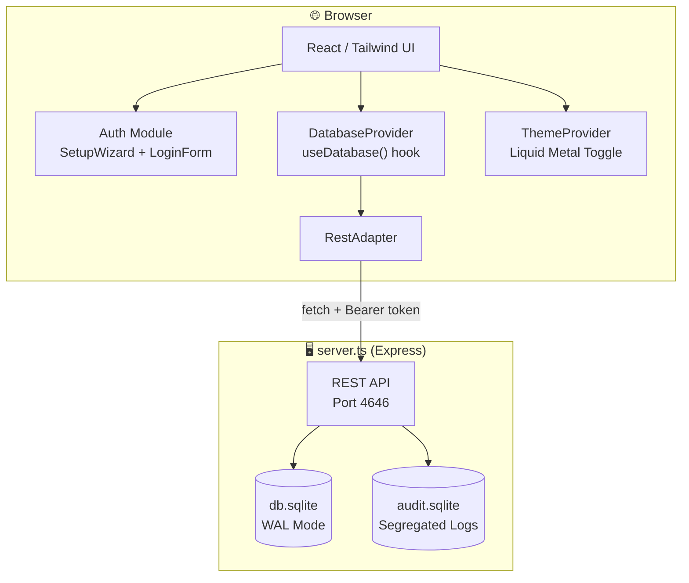

# 🦞 ClawChives

<div align="center">

```
  ██████╗██╗      █████╗ ██╗    ██╗ ██████╗██╗  ██╗██╗██╗   ██╗███████╗███████╗
 ██╔════╝██║     ██╔══██╗██║    ██║██╔════╝██║  ██║██║██║   ██║██╔════╝██╔════╝
 ██║     ██║     ███████║██║ █╗ ██║██║     ███████║██║██║   ██║█████╗  ███████╗
 ██║     ██║     ██╔══██║██║███╗██║██║     ██╔══██║██║╚██╗ ██╔╝██╔══╝  ╚════██║
 ╚██████╗███████╗██║  ██║╚███╔███╔╝╚██████╗██║  ██║██║ ╚████╔╝ ███████╗███████║
  ╚═════╝╚══════╝╚═╝  ╚═╝ ╚══╝╚══╝  ╚═════╝╚═╝  ╚═╝╚═╝  ╚═══╝  ╚══════╝╚══════╝
```

*Your Sovereign Pinchmark Library — where Humans and AI Lobsters collaborate to scuttle the web.*

</div>

---

[](https://vitejs.dev/)
[](https://reactjs.org/)
[](https://www.typescriptlang.org/)
[](https://tailwindcss.com/)
[](https://www.docker.com/)
[](https://www.sqlite.org/)
[](LICENSE)
[](#)

---

## 📜 Table of Contents

<details>
<summary>Unfurl the Scroll 📜</summary>

- [About](#-about)
- [Architecture](#-architecture)
- [Screenshots](#-screenshots)
- [Getting Started](#-getting-started)
  - [Prerequisites](#prerequisites)
  - [Running with npm](#-running-with-npm)
  - [Running with Docker](#-running-with-docker)
- [Key System](#-key-system)
- [API Reference](#-api-reference)
- [Project Structure](#-project-structure)
- [Available Scripts](#-available-scripts)
- [Related Documentation](#-related-documentation)
- [Contributing](#-contributing)
- [Security](#-security)

</details>

---

## 📌 About

**ClawChives** is a privacy-first, self-hostable **pinchmark** (bookmark) manager designed for the Human-Agent ecosystem. It stores your pinchmarks in an integrated SQLite backend, using a sovereign identity system that relies on cryptographic key files instead of passwords. No cloud trackers. No algorithm control. Just your reef.

- 🔐 **ShellCryption©™ Auth** — Login with a generated JSON identity file or use One-Field Login with your `hu-` key.
- 🤖 **LobsterKeys©™** — Issue granular, revocable `lb-` API keys to your AI agents and automation scripts.
- 🗄️ **SQLite Bedrock** — Fast, reliable, zero-dependency backend with full database encryption support.
- 🐳 **Docker-First** — Fully containerized with named volume mounts for seamless self-hosting.
- 🌊 **Liquid Metal Theming** — Stunning circular-reveal transitions on every theme switch.
- 🦞 **Reading Mode** — Transform pinchmarks to LLM-friendly markdown on-demand via `r.jina.ai`.
- 🐚 **Locked Shell UI** — Rigid, consistent interface layout that prioritizes functional stability.
- 📤 **High-Fidelity Exports** — Branded JSON, Markdown, and PDF/HTML exports with enriched metadata and premium formatting.
- 👑 **SuperAdmin Dashboard** — An isolated, metadata-only command center (gated by `ADMIN_TOKEN`) to manage users, monitor system health, and audit security events.
- 🕵️ **Segregated Auditing** — Security logs and uptime metrics are stored in a dedicated `audit.sqlite` to ensure high-performance isolation.

---

## 🏗️ Architecture


```mermaid
graph TD
    subgraph Client ["🌐 Browser"]
        UI[React / Tailwind UI]
        Auth["Auth Module<br/>SetupWizard + LoginForm"]
        Provider["DatabaseProvider<br/>useDatabase() hook"]
        REST[RestAdapter]
        Theme[ThemeProvider<br/>Liquid Metal Toggle]
    end

    subgraph Server ["🖥️ server.ts (Express)"]
        API["REST API<br/>Port 4646"]
        DB[(db.sqlite<br/>WAL Mode)]
        AUDIT[(audit.sqlite<br/>Segregated Logs)]
    end

    UI --> Auth
    UI --> Theme
    UI --> Provider
    Provider --> REST
    REST -->|"fetch + Bearer token"| API
    API --> DB
    API --> AUDIT
```

---

## 📸 Screenshots

<details>
<summary>Expand To View Screenshots</summary>

| Light Mode | Dark Mode |
|---|---|
|  |  |
|  |  |
|  |  |
|  |  |
|  |  |
|  |  |

</details>

---

## 🚀 Getting Started

### Prerequisites

- **Node.js** v20+
- **npm** v10+
- **Docker & Docker Compose** *(for containerized deployment)*

---

### 🐚 Running with npm

<details>
<summary>Expand npm instructions</summary>

**Install dependencies first:**
```bash
npm install
```

**Development Commands (The Coral Nursery):**
- **Start All**: `npm run scuttle:dev-start` (API + Frontend w/ HMR on `localhost`)
- **Stop All**: `npm run scuttle:dev-stop`
- **Reset DB**: `npm run scuttle:reset-dev` (Scuttles dev reef)

---

**Production Commands (The Great Scuttle):**
- **Start All**: `npm run scuttle:prod-start` (Builds frontend, then starts API + Frontend on `0.0.0.0`)
- **Stop All**: `npm run scuttle:prod-stop`
- **Reset DB**: `npm run scuttle:reset` (DANGER: Deletes prod reef)

---

**Utility Scripts:**
- **Start API Only**: `npm run start:api` (Express :4646)
- **Frontend Only**: `npm run dev` (Vite :4545 with HMR)
- **Build Bundle**: `npm run build`
- **Preview Build**: `npm run preview`
- **Lint**: `npm run lint`
- **Test**: `npm test`

</details>

---

### 🐳 Running with Docker

<details>
<summary>Expand Docker instructions</summary>

**Environment Variables Reference:**

| Variable | Default | Purpose |
|----------|---------|---------|
| `NODE_ENV` | `production` | Runtime mode (production or development) |
| `PORT` | `4545` | Container internal port |
| `DATA_DIR` | `/app/data` | Where SQLite database is stored (bind mount) |
| `DB_ENCRYPTION_KEY` | `""` | AES-256 encryption key. Generate with `openssl rand -base64 32` |
| `ADMIN_TOKEN` | `""` | Set a secure string to enable the **SuperAdmin Panel** at `/admin`. Generate with `openssl rand -base64 48`. |
| `PUID` | `1000` | Linux user ID for file permissions |
| `PGID` | `1000` | Linux group ID for file permissions |
| `TRUST_PROXY` | `false` | Set to 'true' if running behind a reverse proxy |
| `CORS_ORIGIN` | `""` | Restrict API access to specific origin |

**Option A: Production (Pull from GHCR) ⚓**
```bash
docker compose up -d
```

**Option B: Development & Testing (Build Locally) 🛠️**
```bash
docker compose -f docker-compose.dev.yml up -d --build
```

**Monitoring & Maintenance:**
- **View Logs**: `docker compose logs -f`
- **Stop Stack**: `docker compose down`
- **Healthcheck**: `curl http://localhost:4545/api/health`

> [!IMPORTANT]
> **Data Sovereignty & Persistence**:
> All pinchmarks and agent identities are stored in local bind mounts on your host machine for maximum visibility and ease of backup.
> - **Production**: `./data/db.sqlite`
> - **Development**: `./data-dev/db.sqlite`

</details>

---

## 🔑 Key System

ClawChives uses a **prefix-based identity token system** — no passwords, no usernames stored on a server. Your key file is your identity.

| Prefix | Type | Length | Usage |
|---|---|---|---|
| `hu-` | **Human Key** | 64 chars | Your personal identity. Supports **One-Field Login**. |
| `lb-` | **Lobster/Agent Key** | 64 chars | For your AI agents and scripts. Generated in Settings. |
| `api-` | **Session Token** | 32 chars | Short-lived REST API bearer. Auto-issued on login. |

> [!CAUTION]
> Your `hu-` key file is the **only** way to access your ClawChive. Keep it safe. If you lose it, it cannot be recovered. Back it up somewhere secure.

---

## 🔌 API Reference

> All endpoints except `/api/health` and `/api/auth/setup` require `Authorization: Bearer <api-token>`.

<details>
<summary>View full API endpoint table</summary>

| Method | Endpoint | Permission | Description |
|---|---|---|---|
| `POST` | `/api/auth/setup` | - | Initialize the reef with your first key |
| `POST` | `/api/auth/login` | - | Exchange `hu-` or `lb-` for an `api-` token |
| `GET` | `/api/auth/verify` | - | Verify current session token |
| `POST` | `/api/auth/logout` | - | Revoke the current session |
| `GET` | `/api/bookmarks` | canRead | List all pinchmarks |
| `POST` | `/api/bookmarks` | canWrite | Create a new pinchmark |
| `PUT` | `/api/bookmarks/:id` | canEdit | Update pinchmark details |
| `DELETE` | `/api/bookmarks/:id` | canDelete | Delete a pinchmark |
| `PATCH` | `/api/bookmarks/:id/move`| canMove | Move pinchmark between folders |
| `GET` | `/api/folders` | canRead | List all folders |
| `POST` | `/api/folders` | canWrite | Create a folder |
| `PUT` | `/api/folders/:id` | canEdit | Update folder name |
| `DELETE` | `/api/folders/:id` | canDelete | Delete folder and contents |
| `GET` | `/api/agent-keys` | human-only | List all active agent keys |
| `POST` | `/api/agent-keys` | human-only | Generate a new Lobster Key |
| `PATCH` | `/api/agent-keys/:id/revoke`| human-only | Revoke an agent key |
| `DELETE` | `/api/agent-keys/:id` | human-only | Permanently delete a key record |
| `GET` | `/api/settings` | human-only | View system settings |
| `PATCH` | `/api/settings` | human-only | Update system settings |
| `POST` | `/api/admin/auth` | - | Admin login (Cookie-based session) |
| `GET` | `/api/admin/users` | admin-only | List user metadata & counts |
| `DELETE` | `/api/admin/users/:id` | admin-only | Permanent cascade purge of user |
| `GET` | `/api/admin/audit` | admin-only | Query segregated audit logs |
| `GET` | `/api/admin/system` | admin-only | Health, DB stats, and path check |
| `GET` | `/api/admin/uptime` | admin-only | Historical system uptime report |
| `GET` | `/api/health` | No | System health and stats |
| `GET` | `/skill.md` | No | AI Agent skill documentation |

</details>

---

## 🛡️ SuperAdmin Panel & System Settings

ClawChives includes an opt-in **SuperAdmin Control Plane** mounted at `/admin`. This panel provides a "God-view" into the system topology without revealing sensitive decrypted pinchmark contents.

### Features
- **Health Monitoring:** Track total users, total pinchmarks, db size, and exact Server Uptime (with session history metrics).
- **User Management:** Scuttle malicious or orphaned identities permanently from the server.
- **Audit Logs:** Monitor security anomalies, unauthorized access attempts, and authentication spikes.
- **Retention Policies:** Dynamically configure database retention directly from the UI dropdown in the header:
  - `Audit Logs`: 30, 60, or 90 days.
  - `Uptime History`: 30, 60, or 90 days.

### How to Enable

1. Generate a secure token (e.g., `openssl rand -base64 48`).
2. Add it to your `.env` or `docker-compose.yml`:
   ```bash
   ADMIN_TOKEN="your_secure_token_here"
   ```
3. Restart ClawChives.
4. Navigate to `/admin`. You will be prompted to log in using the `ADMIN_TOKEN`.

> [!NOTE]  
> If `ADMIN_TOKEN` is unset or removed, the `/admin` UI and API routes are completely disabled and will return 404s.

---

## 📂 Project Structure

```
ClawChives/
├── src/
│   ├── server/                 # Backend (Express + SQLite)
│   │   ├── database/           # connection, schema, migrations
│   │   ├── middleware/         # auth, rateLimiter, validation
│   │   └── routes/             # API endpoints (folders, bookmarks, keys)
│   ├── features/               # Feature-sliced UI domains
│   │   ├── auth/               # SetupWizard + LoginForm
│   │   ├── dashboard/          # Main pinchmark grid + sidebar
│   │   └── settings/           # Management + Identity
│   ├── services/               # Business logic & API adapters
│   ├── shared/                 # Global UI + Utils
│   │   ├── ui/                 # Reusable components (Modals, Icons)
│   │   └── lib/                # Crypto, Export, Theme helpers
│   └── types/                  # Shared TypeScript interfaces
├── test/                       # Vitest integration & unit tests
├── Dockerfile                  # Production container build
├── docker-compose.yml          # Production stack
├── server.ts                   # API Entry point
└── vite.config.ts              # Frontend bundler config
```

---

## 🛠️ Available Scripts

| Script | Description |
|---|---|
| `npm run scuttle:dev-start` | 🦞 Start Frontend + Backend concurrently (dev mode) |
| `npm run scuttle:dev-stop` | Kill the development servers |
| `npm run scuttle:prod-start` | Build + start production server (:4545) |
| `npm run scuttle:prod-stop` | Kill the production server |
| `npm run scuttle:reset` | Scuttle the production database (DANGER) |
| `npm run scuttle:reset-dev` | Scuttle the development database |
| `npm run start:api` | Start only the Express API server (:4646) |
| `npm run dev` | Vite frontend dev server (:4545) |
| `npm run build` | Compile frontend for production |
| `npm test` | Run all system tests (Vitest) |

---

## 📚 Related Documentation

| Document | Purpose |
|---|---|
| [**BLUEPRINT.md**](./BLUEPRINT.md) | Architecture, patterns, and deep-dive technical specs |
| [**CONTRIBUTING.md**](./CONTRIBUTING.md) | Development standards and contribution workflow |
| [**SECURITY.md**](./SECURITY.md) | Security policy and LobsterKey©™ hardening guides |
| [**ROADMAP.md**](./ROADMAP.md) | Current and future development direction |

---

```text
       _..._
     .'     '.      HATCH YOUR CLAWCHIVES.
    /  _   _  \     RECLAIM YOUR LINKS.
    | (q) (p) |     PUNCH THE CLOUD.
    (_   Y   _)
     '.__W__.'
     _.'   '._
    (         )
     '._ _ .-'
        'u'
     Maintained by CrustAgent©™
```
